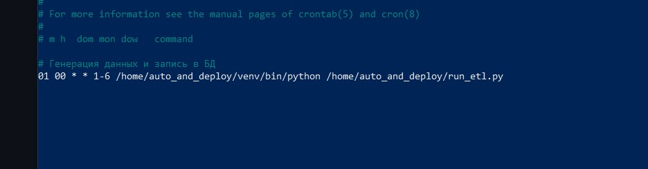
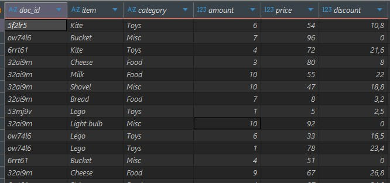

### Данный проект симулирует выгрузку данных о продажах и запись их в базу данных. Этот процесс автоматизирован и выполняется каждый день, кроме воскресенья.

* В директории data находится пример сгенерированных файлов с данными.  
* Настройки crontab:  
  
* Пример таблицы с загруженными данными:  
  
* В директории sql находится код для создания таблицы, в которую будут загружаться данные.  

### Запуск проекта.  
1. Находясь в директории, куда вы намереваетесь скачать этот проект, выполните команду в терминале:  
`git clone https://github.com/EvgenySklyarov81/auto_and_deploy`  
2. Перейдите в директорию `auto_and_deploy` и создайте виртуальное окружение командой:  
`python3 -m venv <имя окружения>`  
3. Активируйте его:  
    * Windows `<имя окружения>\scripts\activate`  
    * Linux   `source <имя окружения>/bin/activate`  
4. Установите необходимые библиотеки командой:  
`pip install -r requirements.txt`  
5. В базе данных, куда вы намереваетесь записывать сгенерированные данные создайте таблицу:  
```
create table if not exists sales (
                                doc_id   varchar(6),
                                item     text,
                                category text,
                                amount   smallint,
                                price    smallint,
                                discount numeric
                                );
```  
                                