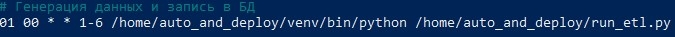

### Данный проект симулирует выгрузку данных о продажах и запись их в базу данных. Этот процесс автоматизирован и выполняется каждый день, кроме воскресенья.

* В директории data находится пример сгенерированных файлов с данными.  
* Настройки crontab:  
  
* Пример таблицы с загруженными данными:  
    

### Запуск проекта.  
1. Находясь в директории, куда вы намереваетесь скачать этот проект, выполните команду в терминале:  
`git clone https://github.com/EvgenySklyarov81/auto_and_deploy`  
2. Перейдите в директорию `auto_and_deploy` и создайте виртуальное окружение командой:  
`python3 -m venv <имя виртуального окружения>`  
3. Активируйте его:  
    * Windows `<имя виртуального окружения>\scripts\activate`  
    * Linux   `source <имя виртуального окружения>/bin/activate`  
4. Установите необходимые библиотеки командой:  
`pip install -r requirements.txt`  
5. В базе данных, куда вы намереваетесь записывать сгенерированные данные, создайте таблицу с помощью кода в [этом](sql/create_table.sql) файле. 
6. В файле [config.ini](config.ini) укажите данные для подключения к вашей базе данных.  
7. Настройка автоматического запуска по расписанию:  
* Linux открыть файл для редактирования командой:  
`crontab -e`  
внести строку:  
`01 00 * * 1-6 <путь к репозиторию>/<виртуальное окружение>/bin/python <путь к репозиторию>/run_etl.py`  
* Windows  
В планировщике заданий создать новую задачу.
На вкладке `Триггеры` созданной задачи создать новый триггер с настройками согласно скриншоту:
  
*Дата и время начала указаны на момент написания этого руководства.*  

На вкладке `Действия` создать новое действие с настройками согласно скриншоту:
  
*Ваши пути будут отличаться от указанных*